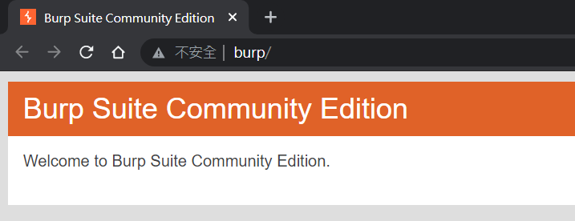

# 目錄
1. [Proxy設定](#Proxy設定)
2. [參考資料](#參考資料)

# Brup Suite 學習筆記
Brute Suite 有
[企業版(Enterprise)](https://portswigger.net/burp/enterprise)、
[專業版(Professional)](https://portswigger.net/burp/pro)
和 [免費版(Community)](https://portswigger.net/burp/communitydownload)
可以選擇，我是下載免費版來使用。

## Proxy設定
要用 Brup Suite 收集網頁的連線資訊，需先將它設定成 Proxy 伺服器：`設定 >> 網路和網際網路 >> Proxy >> 使用 Proxy 伺服器：127.0.0.1:8080` (是 Brup Suite 的預設值，可到 `Proxy >> Options` 查看)。

設置完成後，可以嘗試連線 http://burp/ ，如果出現以下歡迎頁面就代表設置成功。

啊...但是設定完 Proxy 之後開網頁會出現 `NET::ERR_CERT_AUTHORITY_INVALID` 的錯誤，從 http://burp/ 下載並安裝憑證後也還是沒辦法解決，所以就放棄 Proxy 設定了...

如果要用 Proxy 的功能，還是可以直接從 Brup Suite 開啟瀏覽器使用：

## 參考資料
1. [Brup Suite 實戰指南](https://t0data.gitbooks.io/burpsuite/content/)
